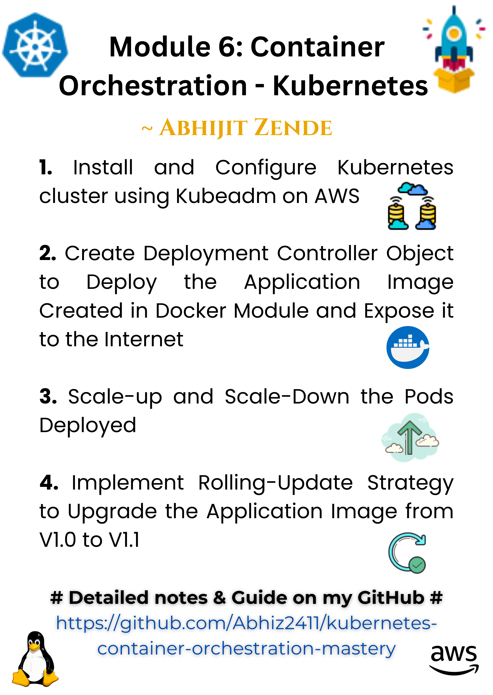

# 🌟 Kubernetes Orchestrator Mastery 🌟

Welcome to **`k8s-orchestrator-mastery`** – your one-stop guide to mastering Kubernetes! 🐳🚀✨

## 📌 What's Inside?

### Module 6 Assignments

1️⃣ **Install and Configure Kubernetes Cluster** 🛠️
   - Set up a Kubernetes cluster using Kubeadm on AWS ☁️.

2️⃣ **Deploy Application Using Deployment Controller** 📦
   - Deploy the application image created in the Docker module and expose it to the internet 🌐.

3️⃣ **Scale Pods Up and Down** 📈📉
   - Demonstrate horizontal scaling of pods 🐙.

4️⃣ **Rolling Updates** 🔄
   - Implement rolling updates to upgrade the application image from V1.0 to V1.1 🆙.

---

### 📖 Kubernetes Notes 📝

- **Key Concepts** 🌱: Understand Pods, Deployments, Services, and more.
- **Step-by-Step Setup** ⚙️: Learn how to configure Kubernetes clusters effortlessly.
- **Commands** 💻: A handy list of `kubectl` commands with examples.
- **Best Practices** ✅: Tips and tricks to use Kubernetes like a pro.

---

## 🚀 Why This Repository?

- 📂 Comprehensive assignments for hands-on learning.
- 📖 Notes to simplify complex concepts.
- 🌐 Real-world examples for deployment and orchestration.

---

## 🌐 Resources

- **[Kubernetes Documentation](https://kubernetes.io/docs/)** 📚
- **[Docker Official Docs](https://docs.docker.com/)** 🐳

---

🔗 **Explore More About Me**  
- 🌐 Portfolio: [https://abhijit-zende.vercel.app/](https://abhijit-zende.vercel.app/)  
- ✍️ Hashnode Blog: [https://abhijitzende.hashnode.dev/](https://abhijitzende.hashnode.dev/)  

---

## 🏷️ Tags

`Kubernetes` · `Containerization` · `DevOps` · `AWS` · `Automation`

---

✨ **Don't forget to star this repo if you find it helpful!** ⭐

